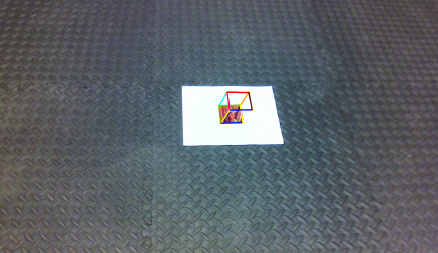

# AR Tag Detection & Tracking

In this project we focus on detecting and tracking a custom AR Tag (a form of feducial marker), that is used for obtaining a
point of reference in the real world. Our implementation involves 2 stages:
- Detection : find the AR Tag from a given frame in the input video
- Tracking  : keep the tag in "view" throughout the video and perform image processing operations based on the tag's pose
  - superimpose Lena image over the AR tag
  - place a virtual cube over the AR tag


<p align="center">
  <p align="center"></p>
</p>

## Dependencies
- Python 3.x
- NumPy
- Matplotlib
- OpenCV

## Usage
- Run the python scripts in the current directory which contains all the code.
- The script runs with one of the sample input "Tag0.mp4" placed in the Data folder, replace it with your own input.
  - Place the relative path of the input you want to run in,
   
    ```
    cap = cv2.VideoCapture('Data/Tag0.mp4')
    ```
    
- Open terminal and run

  ```
  python3 ARdetectTrack.py
  ``` 

## Demo
- https://www.youtube.com/watch?v=6mEs_d0EVQw&list=PLhW-cg34lEh0PNiGCkWEyM831WF444-xT&index=1
- https://www.youtube.com/watch?v=mm8CofT1pkg&list=PLhW-cg34lEh0PNiGCkWEyM831WF444-xT&index=2
